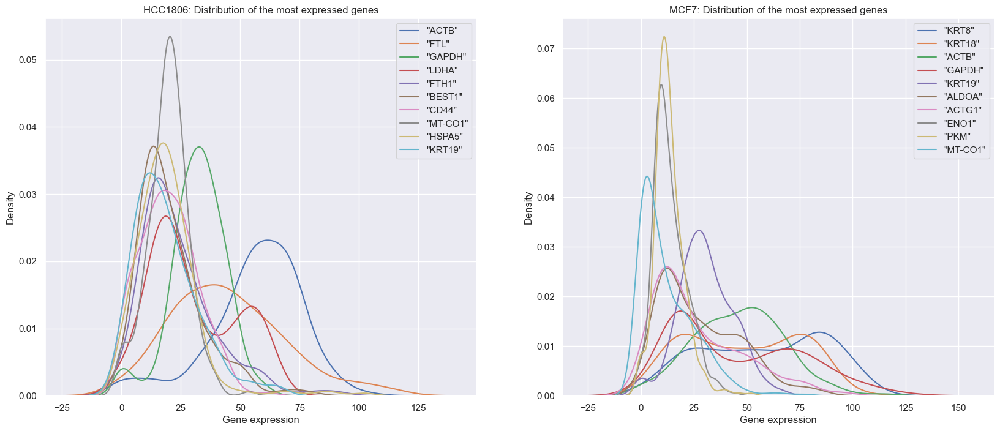
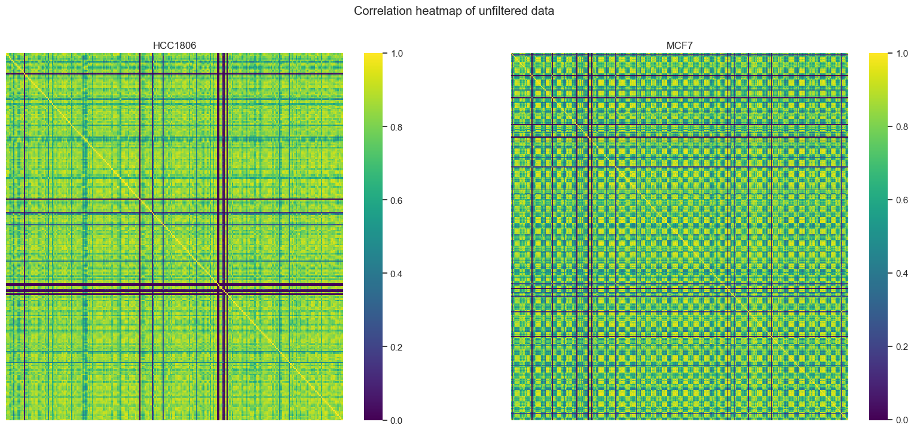
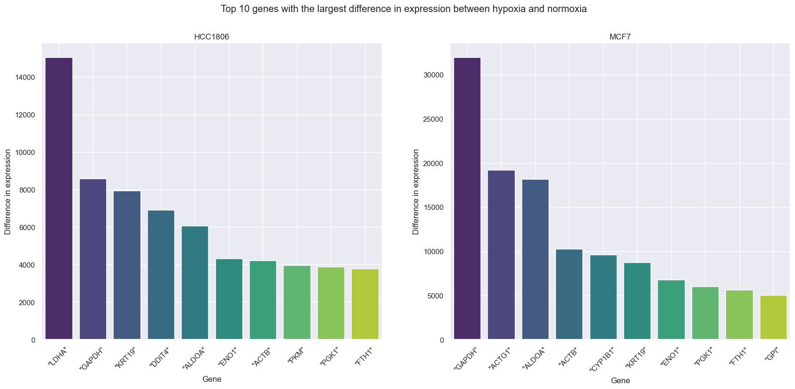
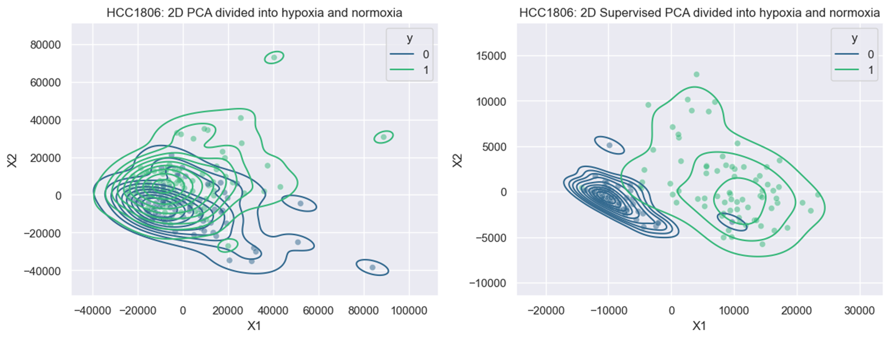
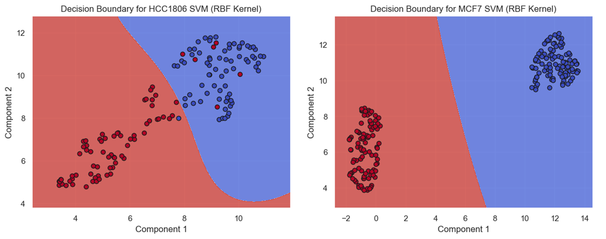
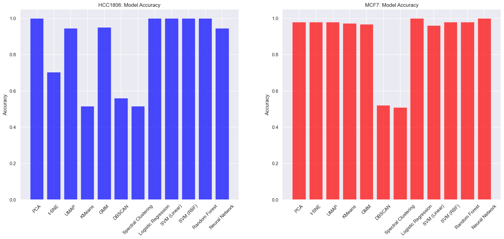

# Prediction on Cancer Cells

## Abstract
For this machine learning project we were tasked to teach a binary classifier to identify if a given cancer cell could survive in a low oxygen environment (i.e. hypoxia) or if the cell needs oxygen to prosper (i.e. normoxia). We used data from an experiment which sequenced RNA from various breast cancer cells. Some cells came from a cell line that was in a low oxygen environment (~1%) and the other cells came from a cell line that was exposed to normal levels of oxygen. The aim for our binary classifier is to identify which genes (found in the RNA) can be attributed to the ability to survive in a low oxygen environment. Intuitively, if a gene were very present in cell from the hypoxia batch and not very present in the normal batch this could possibly mean that this gene helps cancer cells to survive even with very limited oxygen. From a medical point of view, this could help determine whether a certain cancer cell would need to be near arteries or if it could multiply even without a direct source of oxygen.   

## Table of Contents
- [Data](#data)
- [Overview and Results](#overview-and-results)
- [Structure](#structure)
- [Acknowledgements](#acknowledgements)

## Data
We were given data derived utilizing Smart-Seq and Drop-Seq as a sequencing technique. The cell types included in the datasets were MCF7 and HCC1608. As features, we have various genes what were found when sequencing RNA from the various cells. The data was provided to us by Bocconi University, and will not be attached to the Repository.

## Overview and Results
In this section we go over some main results and approaches used in the analysis on the SmartSeq Dataset (for the DropSeq dataset, the techniques used for the analysis are the same).   

### Data Analysis
The first step of our analysis was to perform some general data analysis on the genes and cells of our dataset, looking for some recurrent data, duplicate datapoints or highly correlated features, or characterizing and explaining some information in a clear way.   

First of all we look at the distribution of gene expression for some chosen genes:
   
The above plot (describing the gene expression in the normalized dataset) shows a consistent trend of high frequency of less expressed genes, with some of them being a bit more consistent over a larger expression amount.   

We also looked at the correlation between different genes through a correlation heatmap, where we can see that several pairs of genes are strongly correlated, and very few of them end up being actually uncorrelated:

A more in-depth analysis led to the understanding that the low-correlation genes are often characterized by a much larger amount of zero-entries (~95%) compared to the average (~60%).   

Finally, we looked at the genes showing a strong difference between the two exam groups (normoxia and hypoxia), which could be useful in performing some sanity checks for the models later on (ex. Linear Regression and Random Forests):

### Dimensionality Reduction
Before dwelling in the more common ML approaches and models, we performed dimensionality reduction to observe if the two groups of data end up being clustered in different ways in a low dimensional space.   
On top of this, in this improved Repository, I implemented some "supervised" Dimensionality Reduction approaches, using the known labels to obtain low-dimensional embeddings capable of encoding additional information for distinguishing the different clusters: 

This approach also allows us to perform some prediction on unknown data, by using methods such as k-NN on a low-dimensional embedding (since k-NN doesn't perform well in high dimensions) learned through this supervised approach.

As I will show in the [results section](#results), this approach proved to be very effective, achieving high accuracy comparable to some SOTA approaches, such as Clustering and SVM.

### Models Implemented
To perform this binary classification task, we implemented several basic ML approaches, spacing from clustering (KMeans, GMM, DBSCAN and Spectral Clustering), to SVM (both in 2D - image below - and in high dimensionality), Logistic Regression, Random Forests and MLPs.

### Results
Most of the implemented methods proved to be effective in classifying the SmartSeq Data, as it can be seen from the plot below, which shows Logistic Regression, MLP and Supervised Dimensionality Reduction.

## Structure
The original code for the project can be found in the [BAIology Notebook](BAIology.ipynb), which contains also a descriptive overview of the results submitted for the group project in the course `Machine Learning` for the Bachelor's Course `Mathematical and Computing Sciences for Artificial Intelligence`, Bocconi University, Spring 2023.   
The revisited code is distributed over utils files contained in the `Utils` folder, and are then applied to the data obtained through the two sequencing techniques in the notebooks [Dropseq.ipynb](Dropseq.ipynb) and [SmartSeq.ipynb](SmartSeq.ipynb).

## Acknowledgements
The [original project](https://github.com/fcantatore/BAIology) was completed with [Mattia Barbiere](https://github.com/MattiaBarbiere), [Fabio Cantatore](https://github.com/fcantatore), [Keshav Ganesh](https://github.com/keshavganesh1) and [Elena Kybett Vinci](https://github.com/eleKV).